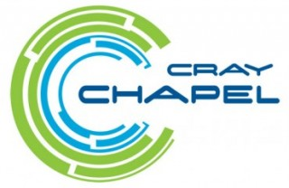

.. _chapelhome-readme:

The Chapel Language
===================

Chapel is an emerging programming language designed for productive parallel computing at scale. Chapel's design and implementation have been undertaken with portability in mind, permitting Chapel to run on multicore desktops and laptops, commodity clusters, and the cloud, in addition to the high-end supercomputers for which it was designed. Chapel's design and development are being led by `Cray Inc.`_ in collaboration with academia, computing centers, and industry. See `chapel.cray.com`_ for more information.

.. _Cray Inc.: http://www.cray.com/
.. _chapel.cray.com: http://chapel.cray.com/

This is the 1.12.0 release of the Chapel compiler, intended to give
potential users a look at what we're doing and the opportunity to
provide us with feedback.  See the LICENSE file for the release's
licensing terms.

Quick Start
-----------

The following instructions are designed to get you up and running with
Chapel with a minimum of fuss.  Note that building and using Chapel in
this mode disables enhanced runtime options and optional language
capabilities in the interest of a simple and clean build.

0) See ``doc/prereqs.rst`` for more information about packages you
   might need to have installed for Chapel to work.

1) Make sure that your shell is in the directory containing this
   ``README.rst`` file.  For example:

    .. code-block:: sh

        cd ~/chapel-1.12.0

2) Set up your environment to use Chapel in "Quick Start" mode.

======================================== ==========================================
If you use:                              then type:
---------------------------------------- ------------------------------------------
a bash-compatible shell (bash/zsh)       ``source util/quickstart/setchplenv.bash``
a csh-compatible shell (csh/tcsh)        ``source util/quickstart/setchplenv.csh``
the fish shell (fish)                    ``. util/quickstart/setchplenv.fish``
the Bourne shell (sh)                    ``. util/quickstart/setchplenv.sh``
======================================== ==========================================

You must be in the top-level Chapel directory for these command
scripts to work properly.  Note that there is no requirement to use
these scripts long-term, they are merely designed to get new users
up and running quickly.  See ``doc/chplenv.rst`` for a complete
description of Chapel's environment variables and their options.

If you use a shell other than the ones listed above and are able to
create an equivalent ``util/quickstart/setchplenv.*`` script for it,
please consider contributing a copy of it back to the project for
inclusion in the next release.

3) Build the compiler and runtime libraries using:

        ``gmake``

   or if your default make is GNU make compatible (as on Mac OS X or
   Cygwin), use:

        ``make``

   Parallel build execution (e.g. ``gmake -j``) is supported.

4) ``csh``/``tcsh`` users only: Update your shell's path cache using:

        ``rehash``

5) To ensure you have installed Chapel properly, you can optionally run an
   automatic sanity check using a few example programs. For this to work
   correctly, you will need python, and ``python-devel`` packages installed on your
   system. See ``doc/prereqs.rst`` for more information.

        ``gmake check``

   or:

        ``make check``

6) Compile an example program using:

        ``chpl -o hello examples/hello.chpl``

7) Execute the resulting executable:

       ``./hello``

8) Experiment with Chapel in Quick Start mode to your heart's content.

   Once you are comfortable with Chapel and interested in using a
   full-featured version in the preferred configuration:

   a) Open up a new shell to avoid inheriting the previous environment
      settings.

   b) Repeat steps 1-7 above, but in Step 2, use ``util/setchplenv.*``
      instead of ``util/quickstart/setchplenv.*``

   This will set up your environment to use Chapel in the preferred
   configuration.  Making this configuration will involve building one
   or more third-party packages which will increase the overall build
   time.  If you run into any portability issues, please let us know
   at chapel_info@cray.com.

9) If you plan to do performance studies of Chapel programs, be sure
   to (a) use the full-featured version and (b) read the ``PERFORMANCE``
   file in this directory to avoid common pitfalls.

What's next?
------------
=============================================== =====================================
**For more detailed information about:**        **refer to:**
----------------------------------------------- -------------------------------------
    changes since the last release              ``CHANGES``
    implementation status                       ``STATUS``
    performance status                          ``PERFORMANCE``
    Chapel's file and directory structure       ``README.files``
    prerequisites for using this release        ``doc/prereqs.rst``
    setting Chapel environment variables        ``doc/chplenv.rst``
    building the compiler                       ``doc/building.rst``
    using the compiler                          ``doc/compiling.rst``
    executing Chapel programs                   ``doc/executing.rst``
    debugging Chapel programs                   ``doc/debugging.rst``                  
    reporting bugs                              ``doc/bugs.rst``
    Chapel modes for emacs and vim              ``etc/README.md``
    example Chapel programs                     ``examples/README``
    a quick reference for Chapel syntax         ``doc/quickReference.pdf``
    the Chapel language specification           ``doc/chapelLanguageSpec.pdf``
    executing programs on multiple locales      ``doc/multilocale.rst``
    how Chapel tasks are mapped to threads      ``doc/tasks.rst``
    calling C code from Chapel                  ``doc/technotes/extern.rst``
    other user and technical notes              ``doc/README``
    third-party software that we use            ``third-party/README``
=============================================== =====================================

=============================================== =====================================
**To use Chapel on a specific platform:**       **refer to:**
----------------------------------------------- -------------------------------------
       a Cray system                            ``doc/platforms/cray.rst``
       Cygwin over Windows                      ``doc/platforms/cygwin.rst``
       an IBM system                            ``doc/platforms/ibm.rst``
       an SGI Altix system                      ``doc/platforms/sgi.rst``
=============================================== =====================================

