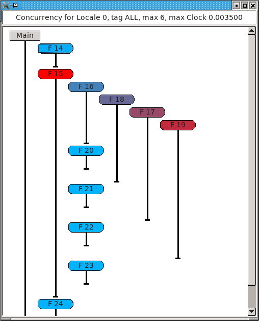
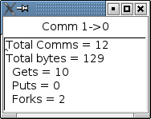

-------
chplvis
-------
A task and communication debug tool for Chapel
----------------------------------------------

*chplvis* is a tool to help the Chapel programmer visualize their
Chapel program's tasks and communication between locales.  Using the
standard module *VisualDebug*, the programmer controls what part
of their program generates information for chplvis.  During the run of
a program using the *VisualDebug* module, data files are
created that are used as input for *chplvis*.  This document
will help you understand the *VisualDebug* module and the
*chplvis* tool.

Setup
-----

*chplvis* is built by giving the command **make chplvis**
at the top level of the chapel tree.  This also builds
the GUI tool, *FLTK*, required to build and
run *chplvis*.  (Note: Some versions of Linux may require the
standard package *libx11-dev* to be installed before *FLTK* will
compile properly.)  To get the most out of this primer, you should
compile and run the example programs and examine
the *VisualDebug* results with *chplvis*.  The graphics
in this primer were produced on a system using the *fifo* threads
instead of the default, *qthreads*, for the tasking layer.   If you use
*qthreads*, your task count may differ from the examples.

Chapel Source Code
------------------

To use *chplvis*, the programmer adds code to their program.  In many
cases, the programmer may want to investigate only part of the program.  This
is accomplished by having functions *startVdebug(name)* and
*stopVdebug()* to control where to start and stop the instrumentation
of their program.  Compilation and execution of these programs remain the
same.  When the *startVdebug(name)* is executed, a collection
of files, one per locale, are created in a directory with the *name* given
in *startVdebug(name)*.

Example 1
---------

Consider the chapel program: (prog1.chpl)

::

     //  Example 1 using visual debug

     use VisualDebug;

     startVdebug("E1");

     coforall loc in Locales do
       on loc do writeln("Hello from locale " + here.id + ".");

     stopVdebug();

Compiling the program and running it with the options *-nl 6* will then
produce a directory called *E1* containing 6 data files, one
for each of the locales and named *E1-n* where *n* is
replaced with the locale number, a number from 0 to 5.  Once this
directory is created, one can run chplvis as *chplvis E1* or
simply *chplvis* and then opening the file *E1/E1-0*
from the *file/open* menu.  The resulting display is:

.. image:: E1.png

(Note: This image is from an X11 display.  On OS-X, the menu bar
will be on the normal menu bar at the top of the screen and will
not show in the main window.)

chplvis Elements
----------------

- The *information* box shows the file set opened, which tag (see
  Example 2) is displayed, and provides a color bar to help visually
  see what values are displayed for locales and communication.

- A *Locale* is represented by a colored box in the main display.  The
  initial display draws the color of the locale to represent the
  number of tasks run at that locale.  For example 1, we can see that
  locale 0 has the most tasks and we expect that to be 12 since that
  is the maximum number of tasks as shown by the color reference in
  the information box at the top of the window.

- *Communication links* are shown by lines between two
  locale boxes.  The color of the line adjacent to a locale box 
  represents the data being sent to that locale from the locale on
  the other end.   For example 1, the line between locale 0 and
  locale 1 is colored red next to locale 0.  This means that there
  is a lot of communications *into locale 0* from locale 1.
  The blue line next to locale 1 means that there is little 
  communication *into locale 1* from locale 0.   *Note:*
  If two locales do not communicate, no line is drawn between them.
  If communication is only one way, the communication color for
  *no communication* is gray.

- The *Data menu* controls what data is used for display colors.  This
  initial data is number of tasks for locales and number of
  communications calls for the communication links.  For locales, one
  can select number of tasks, CPU time at the locale, clock time or
  concurrency at the locale.  Clock time is normally very close to
  equal across all locales.  For the communication links, one can
  select number of communications or size of data sent.</li>

Display Interaction
-------------------

Clicking on elements of the display will bring up more information.
Clicking on a locale will open a new window for that locale showing
information for that locale.  For example, in example 1, clicking on
locale 0 when the locale data is 'number of tasks', 'CPU time' or 'clock
time' will produce a window that looks like:

.. image:: E1-L0.png

(Note: There is overhead generated in tasks, CPU time and clock
time for the Visual Debug function calls.  *chplvis* removes
from the task count the overhead tasks but it can not remove the
CPU and clock time overhead.)

When the locale data selected is 'concurrency', clicking on a locale
will bring up a window that shows task on the locale.  This display
shows the order the tasks are executed and the color of each task
shows the clock time for that task.   For example, locale 0 for this
example shows the window:

In this concurrency display, hovering the mouse over a task will
bring up a "tooltip" that shows the clock time taken by that task,
and if available, the source file name and line number of the code
that started that task.

In the main window, clicking on the red part of the line between
locale 0 and locale 1 will produce a window that looks like:

It is important to notice the direction of the *arrow* in the header
for the windows.  This is for communication from locale 1 to locale 0.
The total number of communication calls was 12.  It is further broken
out into three components:

  - *Gets:* This is a communication call initiated by locale 0 to
    get a data located on locale 1.

  - *Puts:* This is a communication call initiated by *locale 1*
    to put data from locale 1 onto locale 0.

  - *Forks:* This where *locale 1* starts a task running
    on locale 0.  As part of the task start, a block of data is sent to
    locale 0 as an argument to the task.  This data is considered a
    communication call  by *chplvis*.

Example 2
---------

In many programs, one will want to look at a number of small parts of
their program in addition to seeing the total statistics.  prog2.chpl
gives an example of using the *VisualDebug* functions
*tagVdebug(name)* and *pauseVdebug()*.

::

    // Example 2 of use of VisualDebug module and chplvis tool.

    use BlockDist;
    use VisualDebug;

    config var ncells = 10;

    proc main() {

       // Create a couple of domains and a block mapped data array.
       const Domain = { 1 .. ncells };
       const mapDomain = Domain dmapped Block(Domain);

       var  data : [mapDomain] int = 1;

       // Start VisualDebug here
       startVdebug ("E2");

       // First computation step ... a simple forall
       forall i in Domain do data[i] += here.id + 1;

       // Write the result, we want to see the results of the above
       // so we tag before we continue.
       tagVdebug("writeln 1");
       writeln(*data= *, data);
    
       // Second computation step ... using the distributed domain
       tagVdebug("step 2");
       forall i in mapDomain do data[i] += here.id+1;

       // Don't capture for the writeln
       pauseVdebug();
       writeln("data2= ", data);

       // Reduction step
       tagVdebug("reduce");
       var i = + reduce data;

       // done with visual debug
       stopVdebug();

       writeln ("sum is " + i + ".");
    }

Note that the *startVdebug("E2");* is placed after the declarations
so that tasks and communication for the declarations are not included.
The initial display of *chplvis* shows data for the entire run.

.. image:: E2-1.png

There is now a new menu called *Tags* that reflects the
*tagVdebug()* calls in the program.  Selecting the tags menu
gives the following display:

.. image:: E2-2.png

Notice that the tag names are in parentheses.  If a *tagVdebug()*
call is executed more than once, each execution will end up with a
different tag number.  It is possible that this menu could be very long and
require scrolling to see all menu options.  There are two special
tags in this menu, *All* and *Start*.   *All* shows the
initial display for the entire run and *Start* shows the tasks and
communication only between the *startVdebug("E2");* call and the
first call to *tagVdebug()*, in this case, *tagVdebug("writeln 1")*.

Selecting the tag menu option *Start* displays data for all
code between *startVdebug("E2")* and *tagVdebug("writeln 1")*.
The display for the *Start* tag looks like:

.. image:: E2-3.png

You should be able to immediately see that

  - Locale 0 has 3 tasks and all other locales do not have any tasks.
    (Task boxes colored white mean no tasks.)
    This means that locale 0 is doing all the computation.

  - The majority of communication is happening from other locales to
    locale 0.  By clicking on the communication links you should be
    to easily see that locale 0 is doing gets and puts for all the
    communication.

Compare the results of this first *forall* loop with the loop
in the second computation step, tagged *step 2*.  Notice,
*step 2* does not include the second *writeln* because
of the call to *pauseVdebug()*.   That suspends collecting
task and communication data until the next *tagVdebug()* call.

.. image::  E2-5.png

The difference between the two loops is the domain used.   *Domain*
is not a distributed domain, so the computation remains on locale 0. 
The *mapDomain* is a distributed domain, so the computation is 
distributed.  One needs to be careful in specifying these kind of loops
to make sure you use a distributed domain if you are operating on
distributed data and you want distributed computation.  This is 
where *chplvis* can quickly let you know if you used the wrong
domain in your *forall* loop.

Now, consider the *writeln 1* tag display.

.. image:: E2-4.png

Notice the gray communication links.  This means there was no data
flow from locale 0 to the other locales.   The gray links was provided
to make it easy to visually see the corresponding locale.

Finally, for completeness, look at the display for the last tag
used, *reduce*.  It is very similar to the *step 2*
tag.

.. image:: E2-6.png

..  Find more examples to show off more of chplvis 

..  Give examples of how to find problems. 

Final Comments
--------------

The following items are not covered above:

  - By clicking on the locale box or a communication link, a window
    with more detailed information is presented.  To make it easier
    to close those windows, a second click on the same location will
    close the window.   The *Windows* menu allows one to close
    or show all previously created locale and communication windows.

  - The command line for *chplvis* is

    **chplvis [name]**

    where *name* may be the name of the directory or a file in the 
    directory generated by a run of a program using *VisualDebug*.
    If *name* is not given, it looks for the directory named
    **.Vdebug** which is generated if the *startVdebug()*
    function is given a string of zero length.  ("")

