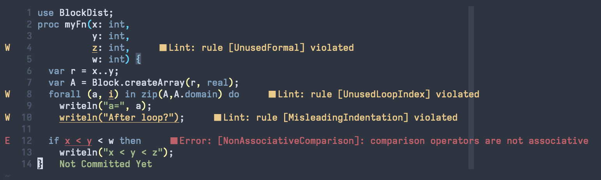

.. _readme-chplcheck:

chplcheck
=========

``chplcheck`` is a linter for the Chapel programming language implemented in
Python using the :ref:`Python bindings for the compiler frontend <readme-chapel-py>`.
It is intended to catch stylistic mistakes and bad practices in Chapel programs.
It is also intended to be customizable and extensible, using a system of named
'rules' that lead to warnings.

``chplcheck`` supports the Language Server Protocol, allowing it to be used as
part of your favorite editor. The following image demonstrates its use in
Neovim:

Getting Started
---------------

The easiest way to make ``chplcheck`` available on your command line is by using the
``chplcheck`` Makefile target. This will build the Dyno compiler frontend and the
Python bindings for Dyno if needed, and place ``chplcheck`` into ``$CHPL_HOME/bin``.
Make sure that you satisfy :ref:`the requirements for building the Python bindings <chapel-py-installation>`.

.. code-block:: bash

   cd $CHPL_HOME
   make chplcheck
   chplcheck --help

Saving the following file into ``myfile.chpl``:

.. code-block:: chapel
   :linenos:

   record MyRecord {}

   for i in 1..10 do {
     writeln("Hello, world!");
   }

The linter is run as follows:

.. code-block:: bash

   > chplcheck myfile.chpl
   path/to/myfile/myfile.chpl:1: node violates rule CamelCaseRecords
   path/to/myfile/myfile.chpl:3: node violates rule DoKeywordAndBlock
   path/to/myfile/myfile.chpl:3: node violates rule UnusedLoopIndex

Enabling / Disabling Rules
--------------------------

Each rule, such as ``CamelCaseRecords``, can be individually enabled or
disabled from the command line using ``--enable-rule`` and ``--disable-rule``.
To silence the warning about unused loop indices such as ``i`` in the above
code, we can invoke ``chplcheck`` as follows:

.. code-block:: bash

   > chplcheck myfile.chpl --disable-rule UnusedLoopIndex
   path/to/myfile/myfile.chpl:1: node violates rule CamelCaseRecords
   path/to/myfile/myfile.chpl:3: node violates rule DoKeywordAndBlock

Some rules are disabled by default. One such rule is ``UseExplicitModules``, which
warns against letting Chapel automatically create the top-level module in a file.

.. code-block:: bash

   > chplcheck myfile.chpl --enable-rule UseExplicitModules
   path/to/myfile/myfile.chpl:1: node violates rule CamelCaseRecords
   path/to/myfile/myfile.chpl:1: node violates rule UseExplicitModules
   path/to/myfile/myfile.chpl:3: node violates rule DoKeywordAndBlock
   path/to/myfile/myfile.chpl:3: node violates rule UnusedLoopIndex

To get a list of all available rules, use the ``--list-rules`` flag. To see
which rules are currently enabled, use the ``--list-active-rules`` flag. If you
have `loaded custom rules <#adding-custom-rules>`_, these will be included
in the output.

.. code-block:: bash

   > chplcheck --list-rules
   ...
   > chplcheck --list-active-rules
   ...

Rules can also be ignored on a case-by-case basis by adding a
``@chplcheck.ignore`` attribute with a string argument stating the rule to
ignore. For example:

.. code-block:: chapel

   @chplcheck.ignore("CamelCaseRecords")
   record MyRecord {}

This will suppress the warning about ``MyRecord`` not being in camelCase.

.. note::

   ``chplcheck.ignore`` is a Chapel attribute and is subject to the same
   limitations as other attributes in the language. This means that it cannot be used to ignore all warnings; for
   example it currently cannot be used on an ``if`` statement.

.. note::

   There is currently no way to ignore more than one rule at at time for a
   given statement. Adding multiple ``chplcheck.ignore`` annotations will
   result in a compilation error.

Fixits
------

Some rules have fixits associated with them. Fixits are suggestions for how to
resolve a given issue, either by editing the code or by adding
``@chplcheck.ignore``. If using ``chplcheck`` as a command line tool, you can
apply these fixits by using the ``--fixit`` flag. When using ``chplcheck`` from
an editor, the editor may provide a way to apply fixits directly with a Quick
Fix.

When using the command line, a few additional flags are available to control how
fixits are applied:

* ``--fixit``: Apply fixits to the file. By default, this is done in-place,
  overwriting the original file with the fixed version.
* ``--fixit-suffix <suffix>``: Apply fixits to a new file with the given suffix
  appended to the original file name. For example, ``--fixit-suffix .fixed``
  would create a new file named ``myfile.chpl.fixed`` with the fixits applied.
* ``--interactive``: Starts an interactive session where you can choose which
  fixits to apply.

Setting Up In Your Editor
-------------------------

``chplcheck`` uses the Language Server Protocol (LSP) to integrate with compatible
clients. If your editor supports LSP, you can configure it to display
linting warnings via ``chplcheck``. See the
:ref:`Editor Support page <readme-editor-support>` for details on a specific
editor.

Writing New Rules
-----------------

Rules are written using the :ref:`Python bindings for Chapel's compiler frontend <readme-chapel-py>`. In
essence, a rule is a Python function that is used to detect issues with the
AST. When registered with ``chplcheck``, the name of the function becomes the name
of the rule (which can be used to enable and disable the rule, as per the
above sections). To mark a Python function as representing a rule,
``chplcheck``'s Python API provides two decorators. These decorators correspond
to the two 'flavors' of rules in the linter: 'basic' and 'advanced'.

Basic Rules
~~~~~~~~~~~

Basic rules are specified using a :ref:`pattern <chapel-py-pattern-matching>`.
This pattern represents which AST nodes should be scrutinized to check if something.
The ``driver.basic_rule`` decorator is used to specify such rules. For instance,
the following basic rule checks that explicit modules have ``PascalCase`` naming:

.. code-block:: python

   @driver.basic_rule(Module)
   def PascalCaseModules(context, node):
       return node.kind() == "implicit" or check_pascal_case(node)

The ``Module`` argument to ``basic_rule`` specifies that the linter should call
the ``PascalCaseModules`` function with each ``Module`` node it encounters. If
the function returns ``True``, no warning should be emitted. If the function
returns ``False``, the linter should produce a warning. The conditional returns
``True`` for all implicit modules, regardless of their name: this is because
implicit modules are named after the file they are in, so the user cannot "fix"
the code by editing it. For explicit modules, a helper function
``check_pascal_case`` is used to ensure that the node's name is appropriately
cased.

Patterns can be more advanced than simply specifying an AST node type. The
following rule makes more use of patterns by specifying that it should be
applied only to ``if``-statements that just have a boolean literal as their
condition.

.. code-block:: python

   @driver.basic_rule([Conditional, BoolLiteral, chapel.rest])
   def BoolLitInCondStmt(context, node):
       return False

Advanced Rules
~~~~~~~~~~~~~~

Sometimes, specifying a pattern is not precise enough to implement a rule. For
example, a linting check might require considering two sibling nodes or other
less-straightforward relationships than "does it match the pattern?". This is
the purpose of advanced rules. These functions are called with the *root* AST
node (usually a top-level ``Module``). Then, it is the responsibility
of the function to find and ``yield`` AST nodes that should be warned about.
For instance, at the time of writing, the following code implements the rule
checking for unused formals.

.. code-block:: python

   @driver.advanced_rule
   def UnusedFormal(context, root):
       formals = dict()
       uses = set()

       for (formal, _) in chapel.each_matching(root, Formal):
           # For now, it's harder to tell if we're ignoring 'this' formals
           # (what about method calls with implicit receiver?). So skip
           # 'this' formals.
           if formal.name() == "this":
               continue

           # extern functions have no bodies that can use their formals.
           if formal.parent().linkage() == "extern":
               continue

           formals[formal.unique_id()] = formal

       for (use, _) in chapel.each_matching(root, Identifier):
           refersto = use.to_node()
           if refersto:
               uses.add(refersto.unique_id())

       for unused in formals.keys() - uses:
           yield formals[unused]

This function performs _two_ pattern-based searches: one for formals, and one
for identifiers that might reference the formals. It then emits a warning for
each formal for which there wasn't a corresponding identifier.

Making Rules Ignorable
~~~~~~~~~~~~~~~~~~~~~~

The linter has a mechanism for marking a rule as supporting the ``@chplcheck.ignore`` attribute. When rules are marked as such, the linter will automatically
provide a `fixit <#writing-fixits>`_ to apply the attribute.

Ignorable basic rules should return ``BasicRuleResult`` with ``ignorable`` set
to ``True`` rather than just a boolean. The ``BasicRuleResult`` constructor
takes a ``AstNode`` as an argument, which is the node that the rule is being
applied to. For example, the following defines a basic rule that is ignorable:

.. code-block:: python

   @driver.basic_rule(chapel.Function)
   def NoFunctionFoo(context, node):
       if node.name() == "foo":
           return BasicRuleResult(node, ignorable=True)
       return True

Ignorable advanced rules should yield a ``AdvancedRuleResult`` with ``anchor``
set rather than just a ``AstNode``. The ``AdvancedRuleResult`` constructor
takes an ``AstNode`` as an argument, which is the node that the rule is being
applied to. The ``anchor`` is the node should have a ``@chplcheck.ignore``
annotation to suppress the warning. ``anchor`` and ``node`` can be the same
node. For example, the following defines an advanced rule that is ignorable:

.. code-block:: python

   @driver.advanced_rule
   def NoLoopIndexI(context, root):
       for loop, _ in chapel.each_matching(root, IndexableLoop):
           idx = loop.index()
           if idx.name() == "i":
               yield AdvancedRuleResult(idx, anchor=loop)

Since loop indices can't have attributes applied to them directly, the rule above uses the parent loop as an anchor. Applying the attribute to the loop will silence the warning on the index.

.. _writing-fixits:

Fixits
~~~~~~

Rules can have fixits associated with them, which allow ``chplcheck`` to
automatically resolve issues it encounters. To define a fixit, the rule should
construct a ``Fixit`` object and associate it with its result
(``BasicRuleResult`` or ``AdvancedRuleResult`` for basic and advanced rules,
respectively). This can be done in two ways (see below).

A ``Fixit`` contains a list of ``Edit`` objects to apply to the code and an
optional description, which is shown to the user when the fixit is applied.
``Edit`` objects contain a file path, a range defined by start and end
positions, and the text to replace inside of that range. The recommend way to
create an ``Edit`` object is to use the ``Edit.build`` class method, which
takes a ``chapel.Location`` and the text to replace it with.

For example, the following defines a rule that has a fixit associated with it:

.. code-block:: python

   @driver.basic_rule(chapel.Function)
   def NoFunctionFoo(context, node):
       if node.name() == "foo":
           fixit = Fixit.build(Edit.build(node.name_location(), "bar"))
           fixit.description = "Replace 'foo' with 'bar'"
           return BasicRuleResult(node, fixits=[fixit])
       return True

.. note::

    The fixit for 'NoFunctionFoo' demonstrated here is not production-ready.
    It does not rename the uses of the function, nor does it check for conflicts
    with other names in the file. It is intended only to demonstrate the API for
    defining fixits. The same is true for various other versions of this
    example in this section.

The above code snippet directly uses a ``fixits=`` argument to the
``BasicRuleResult`` constructor. This is one of two ways to associate fixits with
rules. Both advanced and basic rule results support this constructor argument.

Constructing the ``Edit`` objects can become relatively complicated for more
powerful auto-fixes. In practice, ``chplcheck`` developers have observed
that the code to construct the necessary edits can be longer than the code
implementing the rule. To provide a separation of concerns between
"what should be warned about" and "how to fix the warning", ``chplcheck``
provides a second mechanism to attach fixits to rules: the ``@driver.fixit``
decorator.

This decorator accepts the rule-to-be-fixed as an argument, and wraps a function
that accepts the result of the rule. The wrapped function should use
the information returned by the rule to construct a ``Fixit`` object or a list of
``Fixit`` objects.

For example, the snippet above can be written using the decorator as follows:

.. code-block:: python

   @driver.basic_rule(chapel.Function)
   def NoFunctionFoo(context, node):
       return node.name() != "foo"

   @driver.fixit(NoFunctionFoo)
   def FixNoFunctionFoo(context, result: BasicRuleResult):
       fixit = Fixit.build(Edit.build(result.node.name_location(), "bar"))
       fixit.description = "Replace 'foo' with 'bar'"
       return fixit

Multiple fixits can be attached to a rule by using the ``@driver.fixit`` decorator
several times.

Particularly complicated rules can do a number of AST traversals and computations
to determine whether a warning should be emitted. The information gathered
in the process of these computations may be required to issue a fixit. When
using the ``@driver.fixit`` decorator, it appears as though this information
is lost. To address this, both ``BasicRuleResult`` and ``AdvancedRuleResult``
accept an additional ``data`` argument. This argument can be of any type.
When decorator-based fixit functions are invoked, this ``data`` can be accessed
as a field on the result object.

.. code-block:: python

   @driver.basic_rule(chapel.Function)
   def NoFunctionFoo(context, node):
       if node.name() == "foo":
           return BasicRuleResult(node, data="some data")
       return

   @driver.fixit(NoFunctionFoo)
   def FixNoFunctionFoo(context, result: BasicRuleResult):
       print(result.data)  # prints "some data"
       fixit = Fixit.build(Edit.build(result.node.name_location(), "bar"))
       fixit.description = "Replace 'foo' with 'bar'"
       return fixit

.. note::

   The API for defining fixits is still under development and may change in the
   future.

Adding Custom Rules
-------------------

Developers may have their own preferences for their code they would like to be
enforced by a linter. Rather than adding their own rule to ``rules.py``,
developers can load a custom rule file that contains all of their custom rules.

For example, the following code is a complete definition of two new rules for
``chplcheck``. Note that the top-level function must be named ``rules`` and take
one argument.

.. code-block:: python

   # saved in file `myrules.py`
   import chapel

   def rules(driver):

     @driver.basic_rule(chapel.Function)
     def NoFunctionFoo(context, node):
       return node.name() != "foo"

     @driver.basic_rule(chapel.Variable, default=False)
     def NoVariableBar(context, node):
       return node.name() != "bar"

To use these rules with ``chplcheck``, use the ``--add-rules`` command line
argument.

Saving the following file into ``myfile.chpl``:

.. code-block:: chapel
   :linenos:

   proc foo() {
     var bar = 10;
   }

The linter is run as follows:

.. code-block:: bash

   > chplcheck myfile.chpl --add-rules path/to/my/myrules.py --enable-rule NoVariableBar
   path/to/myfile/myfile.chpl:1: node violates rule NoFunctionFoo
   path/to/myfile/myfile.chpl:2: node violates rule NoVariableBar

