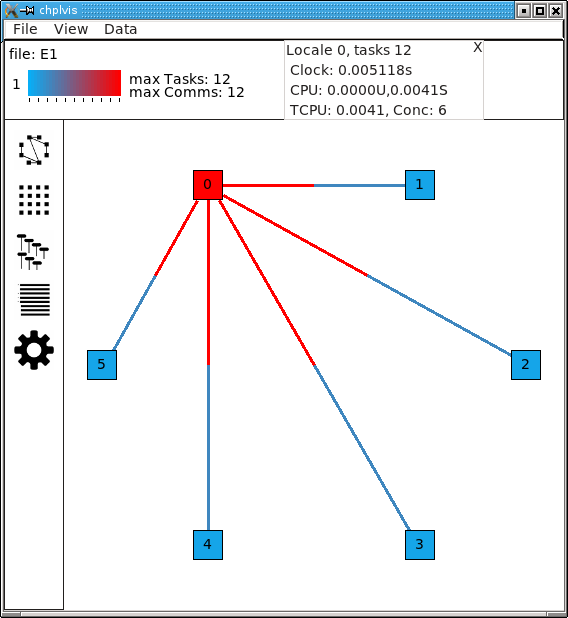
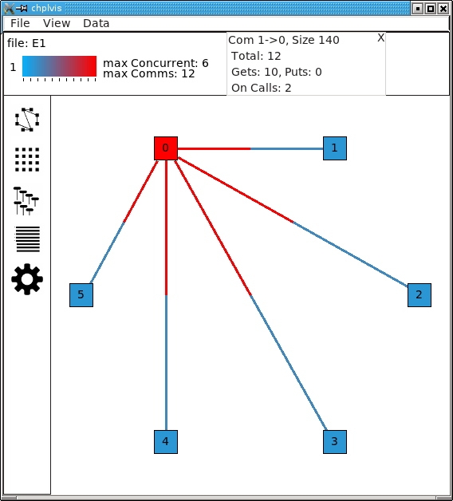
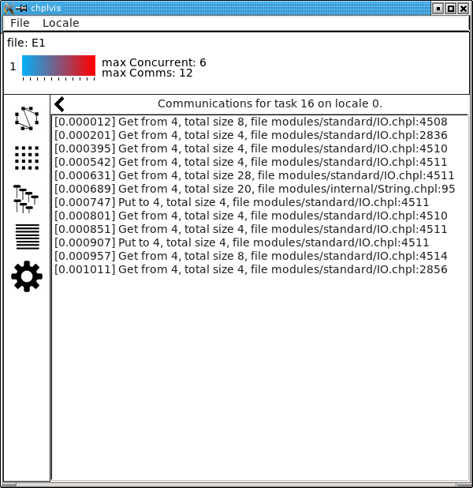
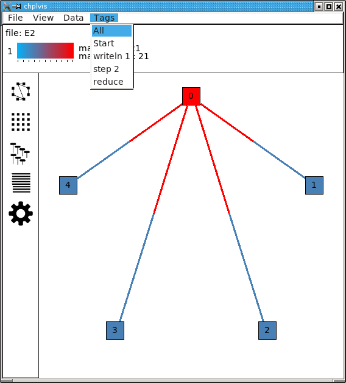
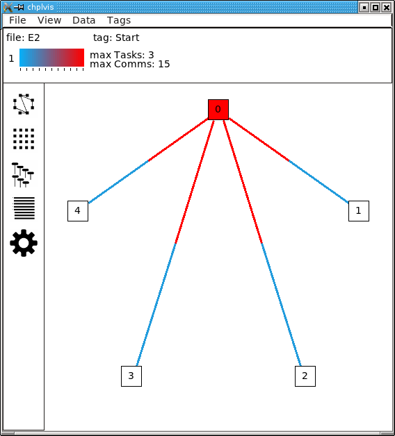
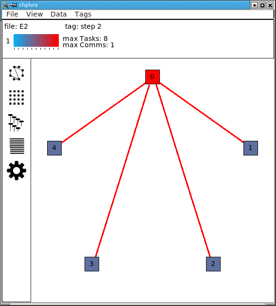
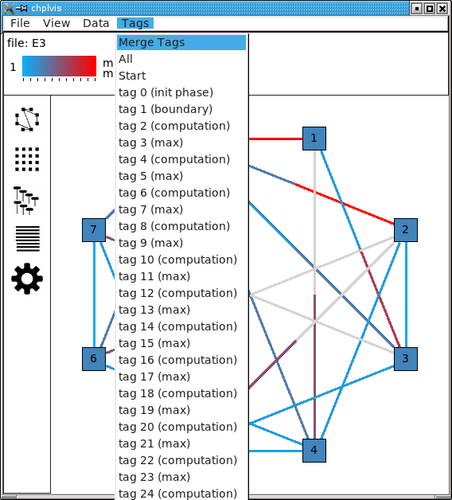

.. _chplvis:

.. default-domain:: chpl

-------
chplvis
-------
A Task and Communication Debug Tool for Chapel
----------------------------------------------

``chplvis`` is a tool to help the Chapel programmer visualize their
Chapel program's tasks and communication between locales.  Using the
standard module :mod:`VisualDebug`, the programmer controls what part
of their program generates information for ``chplvis``.  During the run of
a program using the :mod:`VisualDebug` module, data files are
created that are used as input for ``chplvis``.  This document
will help you understand the :mod:`VisualDebug` module and the
``chplvis`` tool.

Setup
-----

``chplvis`` is built by giving the command ``make chplvis`` at the top level of
the chapel tree.  This also builds the GUI tool, *FLTK*, required to build and
run ``chplvis``.  (Note: Some versions of Linux may require the standard
package ``libx11-dev`` to be installed before *FLTK* will compile properly.)
To get the most out of this primer, you should compile and run the example
programs and examine the :mod:`VisualDebug` results with ``chplvis``.  The
example programs are found on the path ``examples/primers/chplvis``.  The
graphics in this primer were produced on a system using the ``fifo`` threads
instead of the default, ``qthreads``, for the tasking layer.   If you use
``qthreads``, your task count may differ from the examples.

Chapel Source Code
------------------

To use ``chplvis``, the programmer adds code to their program.  In many
cases, the programmer may want to investigate only part of the program.  This
is accomplished by having functions :proc:`~VisualDebug.startVdebug` and
:proc:`~VisualDebug.stopVdebug` to control where to start and stop the
instrumentation of their program.  Compilation and execution of these programs
remain the same.  When the :proc:`~VisualDebug.startVdebug` is executed, a
collection of files, one per locale, are created in a directory with the
``name`` given in :proc:`~VisualDebug.startVdebug`.

Example 1
---------

Consider the chapel program ``chplvis1.chpl``: (The example programs in this
primer are found in the directory ``examples/primers/chplvis`` in your
distribution tree.)

.. literalinclude:: examples/primers/chplvis/chplvis1.chpl
   :language: chapel
   :lines: 1-3, 6-28

Compiling the program and running it with the options ``-nl 6`` will then
produce a directory called ``E1`` containing 6 data files, one
for each of the locales and named ``E1-n`` where ``n`` is
replaced with the locale number, a number from 0 to 5.  Once this
directory is created, one can run ``chplvis`` as ``chplvis E1`` or
simply ``chplvis`` and then open the file ``E1/E1-0`` from the
``file/open`` menu.  The resulting display is:

(Note: This image is from an X11 display.  On OS-X, the menu bar
will be on the normal menu bar at the top of the screen and will
not show in the main window.)

chplvis Elements
----------------

- The *information* box shows the file set opened, which tag (see
  `Example 2`_ ) is displayed, the maximum values of the data
  currently being displayed and a color bar to help visually see what
  values are displayed for locales and communication.  This
  *information* box is also used to show various other information as
  described below.

- The *view selection* box on the left edge of the display allows the
  user to select how to view the *VisualDebug* data.  There are four
  data views and a settings view.

- The *data view area* box is the main display of data.  The data views
  are the *graph* view, the *grid* view, the *concurrency* view and the
  *profile* view.  The *settings* view is also displayed in the
  *data view area*.

- Menus control many aspects of ``chplvis``.   These menus are different
  depending what data view is visible.   Also, a mouse right click
  in the *data view area* will cause a pop-up menu to be shown that
  is a duplicate of the data view's menus on the main menu bar.

  
Graph View
~~~~~~~~~~

The *graph view* is the default view when ``chplvis`` is run. The
following are shown in the *graph view*:

- A *Locale* is represented by a colored box.  The initial display
  draws the color of the locale to represent the number of tasks run
  at that locale.  For example 1, we can see that locale 0 has the
  most tasks and we expect that to be 12 since that is the maximum
  number of tasks as shown by the color reference in the information
  box at the top of the window.  Hover your mouse over a locale and it
  will display a "tooltip" that is the value for that locale.

- *Communication links* are shown by lines between two
  locale boxes.  The color of the line adjacent to a locale box
  represents the data being sent to that locale from the locale on
  the other end.   For example 1, the line between locale 0 and
  locale 1 is colored red next to locale 0.  This means that there
  is a lot of communications *into locale 0* from locale 1.
  The blue line next to locale 1 means that there is little
  communication *into locale 1* from locale 0.

  .. note::

    If two locales do not communicate, no line is drawn between them.  If
    communication is only one way, the communication color for *no
    communication* is gray.

- The *Data* menu controls what data is used for the display colors
  and available tooltip values.  This initial data is number of tasks
  for locales and number of communications calls for the communication
  links.  For locales, one can select number of tasks, CPU time, clock
  time or concurrency.  Clock time is normally very close to equal
  across all locales.  For the communication links, one can select
  number of communications or size of data sent.

- The *View* menu allows the user to zoom in or out in the data display.

Grid View
~~~~~~~~~

The *grid view* displays the same information as the *graph view* but in
a different format. The *grid view* display looks like:

The elements of the *grid view* are:

- Each *Locale* is shown twice in this view, vertical on the left of
  the view and horizontal along the top of the view.  The top most
  and left most locales represent *locale 0*.  (If the box is big enough,
  the locale number is placed in the box.  With a large number of locales
  displayed, they locale number may be too big to fit in the display box.)

- *Communication links* are shown as boxes in the center of the display.
  Data transmission is *from* locale i on the left *to* locale j on the top
  and is shown in the box on row i and column j.  This box is colored to
  represent the amount of data sent from locale i to locale j.  (This is
  either the number of communications or the size of data sent as controlled
  by the *Data* menu.)  Communication boxes with no color represent no
  communication.  (The diagonal will always be white since no locale sends
  data to itself over the communication subsystem.)

- The menus for the *grid view* are the same as the *graph view*.

.. _`Concurrency View`:
  
Concurrency View
~~~~~~~~~~~~~~~~

The *concurrency view* shows task information for a single locale.  Chapel
programs run by starting low level tasks to do the required jobs. This
display shows the order the tasks are executed and the color of each
task shows the clock time for that task.  The black vertical vertical
lines show the life time of the task.  There are two kinds of tasks
shown: tasks started remotely via the ``on`` statements (on calls) to
this locale indicated by an *OC* and tasks started locally indicated
by an *L*.  Also, some tasks communicate with other locales and others
do not.   The tasks that communicate with other locales are marked with
an asterisk before the *OC* or *L*.

.. note::

  The task order may change from run to run.  The following shows one possible
  execution order of the tasks:

Note the special *Main* task.  It is shown as a square gray box because
it was already running at the start of the displayed data.

Menus allow the user to change the displayed locale and tag.  The
above example does not show the tags menu because no tags were
defined for this example program.

Profile View
~~~~~~~~~~~~

Chapel programs are run by the runtime executing tasks.  Each task runs
an *internal function*.   These functions are generated by the compiler and
the VisualDebug system tracks these functions and tasks.   In the *profile
view*, these functions are displayed.   Data collected for each function is
total CPU and clock time spent in the function as well as the number of
puts, gets and 'on calls' performed by the function.   This view sorts the
list of internal functions based on the chosen data.  The default data
is clock time.  Functions with a zero value are not displayed, so not
every function will be displayed for all data selections.  Each line
shows the data (e.g. clock), the internal function name which may not
make much sense to the developer, and the Chapel source file and line number
that for which the task was created.  The following
as an example of the *profile view*.

.. note::

   Clock time for a function is total time for all tasks that
   run in that function.  This shows a total accumulation of time, but
   it does not show the effects of concurrency on running time of the
   program.  At the current time, the data does not easily yield the
   total time a function contributes to the overall time of a program.

Settings
~~~~~~~~

``chplvis`` has two settings that are set by a *settings view* and are
saved in a file named ``~/.cache/chplvis``.   First, the user can
select custom colors for the 'heat' displays.  The standard colors are
used in this document.  Next, ``chplvis`` can save the window size
of the main display for use on the next execution.   Both of these
settings are set in the settings window.  The settings window is
opened via the ``file/settings`` menu option.  The settings window
looks like:

The ``Use for this run only`` button allows the user to choose custom
heat colors for the current run only and on the next run, the default
or saved colors will be used.   The ``window size`` setting is 
ignored when this button is clicked.
   
   
Display Interaction
-------------------

Clicking on elements of the display will bring up more information.
In *graph view* and *grid view*, clicking on a locale will add a box
to the *information* box with the information about that locale.  In
example 1, clicking on locale 0 when the locale data is 'number of
tasks', 'CPU time' or 'clock time' will produce a display that looks
like:

(Note: There is overhead generated in tasks, CPU time, clock time and
communication for the Visual Debug function calls.  ``chplvis`` removes
the overhead tasks and communication from displayed values, but it can
not remove the CPU and clock time overhead.)

In *grid view*, clicking on a communication line will create an
*information* box with communication information for that link.  Clicking red
part of the line between locale 0 and locale 1 will produce a display
that looks like:

It is important to notice the direction of the *arrow* in the header
for the box.  This is for communication from locale 1 to locale 0.
The total number of communication calls was 12.  It is further broken
out into three components:

  - *Gets:* This is a communication call initiated by locale 0 to
    get a data located on locale 1.

  - *Puts:* This is a communication call initiated by *locale 1*
    to put data from locale 1 onto locale 0.

  - *On Calls:* This where *locale 1* starts a task running
    on locale 0.  As part of the task start, a block of data is sent to
    locale 0 as an argument to the task.  This data is considered a
    communication call  by *chplvis*.

The same communication information box is presented in *grid view* when
a communication box is clicked.

When the locale data selected is 'concurrency' in *graph view* or
*grid view*, clicking on a locale will switch to the 
`Concurrency View`_ and select the locale which was clicked.

In the *Concurrency View*, clicking on a task that has communication
(noted by the asterisk) will bring up a list of communications.  This
looks like:

The number in brackets is the clock time since the task started
execution.   This list gives details about the *gets*, *puts* and
*on calls* initiated by this task.

In this list, clicking on any line that has a file name will bring up
that source code file and position the display on the line responsible
for the communication.  This line in the source code file is
highlighted.

In a similar way, in the *Profile View*, clicking on a function line
will also display the file and line, highlighted, of the line that
caused the internal function to be defined.

*Tool tips* are available in several of the data views.  Locales
in the *graph* and *grid* views have tool tips that show the value
selected for display, for example, the clock time.  In the *grid view*,
the communication squares have tool tips showing the communication value
selected.  In the *concurrency view*, tool tips show the communication
values and in the case of a local task, the file and line number that
called that task.

.. _`Example 2`:

Example 2
---------

In many programs, one will want to look at a number of small parts of
their program in addition to seeing the total statistics.  ``chplvis2.chpl``
gives an example of using the :mod:`VisualDebug` functions
:proc:`~VisualDebug.tagVdebug` and :proc:`~VisualDebug.pauseVdebug`.

.. literalinclude:: examples/primers/chplvis/chplvis2.chpl
   :language: chapel
   :lines: 1-3, 6-

Note that the ``startVdebug("E2")`` is placed after the declarations
so that tasks and communication for the declarations are not included.
The initial display of ``chplvis`` shows data for the entire run. (This
program was run on five locales.)

.. image:: E2-1.png

There is now a new menu called *Tags* that reflects the
:proc:`~VisualDebug.tagVdebug()` calls in the program.  Selecting the tags menu
gives the following display:

There are two special tags in this menu, *All* and *Start*.  *All*
shows the initial display for the entire run and *Start* shows the
tasks and communication only between the ``startVdebug("E2")`` call and
the first call to :proc:`~VisualDebug.tagVdebug()`, in this case, ``tagVdebug("writeln
1")``.  The display for the *Start* tag looks like:

You should be able to immediately see that

  - Locale 0 has 3 tasks and all other locales do not have any tasks.
    (Locale boxes colored white mean no tasks at that locale.)
    This means that locale 0 is doing all the computation.

  - The majority of communication is happening from other locales to
    locale 0.  By clicking on the communication links you should be
    to easily see that locale 0 is doing gets and puts for all the
    communication.

Compare the results of this first ``forall`` loop with the loop in the second
computation step, tagged *step 2*.  Notice, *step 2* does not include the
second ``writeln`` because of the call to :proc:`~VisualDebug.pauseVdebug()`.
That suspends collecting task and communication data until the next
:proc:`~VisualDebug.tagVdebug()` call.

The difference between the two loops is the domain used.   *Domain*
is not a distributed domain, so the computation remains on locale 0.
The ``mapDomain`` is a distributed domain, so the computation is
distributed.  One needs to be careful in specifying these kind of loops
to make sure you use a distributed domain if you are operating on
distributed data and you want distributed computation.  This is
where ``chplvis`` can quickly let you know if you used the wrong
domain in your ``forall`` loop.

Now, consider the *writeln 1* tag display.

Notice the gray communication links.  This means there was no data
flow from locale 0 to the other locales.   The gray links are provided
to make it easy to visually see the corresponding locale.

Finally, for completeness, look at the display for the last tag
used, *reduce*.  It is very similar to the *step 2*
tag.

Example 3
---------

The program ``chplvis3.chpl`` computes the solution of a Laplace equation
using the Jacobi method.  This version uses dmapped domains
and VisualDebug.  Only parts of the code are shown to illustrate
other ``chplvis`` features.  First, config variables are handy here so one
can create different directories of chplvis data on different runs.
Although not shown here, config params are useful to allow your
program to use VisualDebug and generate data only if you need it.

.. code-block:: chapel

    // Allow different runs to create different data directories so it is
    // easier to compare runs with chplvis.
    config var dirname = "E3";

    // Start VisualDebug here to see that distributed domain and variable
    // declarations generate tasks and communication.
    startVdebug(dirname);

Next, if :proc:`~VisualDebug.tagVdebug()` calls are made inside a loop, it
produces a unique tag for each call.

.. code-block:: chapel

   // Main computation loop -- we want to see the two parts of this
   // loop, the computation and the reduction part.

   while (delta > epsilon) {

     // Tag the computation part of this loop
     tagVdebug("computation");

     for t in 1 .. compLoop do {
       forall (i,j) in R do
         A(i,j) = Temp(i,j);
       forall (i,j) in R do
         Temp(i,j) = (A(i-1,j) + A(i+1,j) + A(i,j-1) + A(i,j+1)) / 4.0;
     }

     // tag the reduction part of this loop.
     tagVdebug("max");
     forall (i,j) in R {
       Diff(i,j) = abs(Temp(i,j)-A(i,j));
     }
     delta = max reduce Diff;

     pauseVdebug();
     iteration += compLoop;
     if (verbose) {
       writeln("iteration: ", iteration);
       writeln("delta:     ", delta);
       writeln(Temp);
     }
   }

We use :proc:`~VisualDebug.pauseVdebug()` here to make sure chplvis data is generated for
the parts of the loop of interest.

This example was run with the command line arguments ``--n=8 -nl 8``.
The following shows the default *tags* menu for this run:

Notice that the tags are now numbered and the tags menu extends past
the end of the window. (This screenshot does not show the entire tags
menu that was displayed on the screen.)  *All* and *Start* remain the
same, but since two or more tags have the same name, ``chplvis`` shows a
unique tag for each :proc:`~VisualDebug.tagVdebug()` call.  Notice the new menu
item above *All* which is highlighted in this example.  *Merge Tags* allows you
to see data for tags with the same name to be merged together.  For this
example, with merged tags, the tags menu now looks like:

.. image:: E3-2.png

Now, selecting the tag *computation* will show the accumulated tasks and
communication for the entire *while* loop for just the computation
part of the loop.  This is all code between the ``tagVdebug("computation")``
call and the ``tagVdebug("max")`` call.   Selecting the tag *max* will
then show accumulated tasks and communication for the code between
the ``tagVdebug("max")`` call and the :proc:`~VisualDebug.pauseVdebug()` call.
The following shows the display for the *computation* tags and displaying *CPU*
data.

The concurrency display is not available for tags in the "merge tag mode"
except the *All* tag, which is the same for both tags mode.

This example has some extra config variables that can be used to help
understand the usefulness of ``chplvis``.  For example, one can compare
the CPU time used between the *computation* and *max* phases of this
Jacobi computation.  The config variable *compLoop* allows one to run
the computation loop more than once before then checking for convergence
in the *max* tagged code.  It is known that the Jacobi code will not
diverge and thus extra computation steps will not produce a "wrong"
answer.  By doing extra computation, the result will be a bit more
accurate.  The reader should use the *compLoop* and the *dirname*
config variables to run several versions of this program yielding
a ``chplvis`` directory for each run.  Then one can compare the different
results by running ``chplvis`` multiple times.  By a good choice of
the *compLoop* variable, one can dramatically reduce the CPU time for
computing the *max* while not increasing the *computation* time by much.

Example 4
---------

To help show another feature of the "`Concurrency View`_", ``chplvis4.chpl``
was written to create a *begin* task on all locales and have those tasks
live across calls to the :mod:`VisualDebug` module.  The code is:

.. literalinclude:: examples/primers/chplvis/chplvis4.chpl
   :language: chapel

First we will look at the results of running this code on a single
locale.  Even though there is no communication, ``chplvis`` can help
you see how tasks are run, especially how much concurrency you have.

This view shows the tasks for locale 0, the only locale in this run.
Things to notice from this view are

  - Main represents the main program.  It is shown as a gray rectangular
    box to show that it was running at the time of
    :proc:`~VisualDebug.startVdebug()` was called.

  - In the *tag ALL* view, tags are shown in the sequence of tasks.

  - Task *OC 29* is started before the *loc* tag, but it finishes
    in the *finish* tag.

This view shows the tasks for locale 1 on a 3 locale run for the tag
*loc*.  In this view, the task started before the *loc* tag appears
as a gray rectangular box at the top of the view.  This indicates
that is was running at the start of the tag.  The lack of a task
termination horizontal line on the task line indicates that the task
continued running past the end of the tag.  Tasks that are running
at the beginning of a tag and terminate during a tag can be seen
by the horizontal termination line, such as for task *C50*, a
*continued* task for locale 0 on the same 3 locale run as seen next.

*Main* will always show as a continued task with no termination.
*Main* is shown only for locale 0.  *Main* is included in the
calculation of concurrency as seen above.

..  Find more examples to show off more of chplvis

..  Give examples of how to find problems.

Config Parameters and Variables
-------------------------------

Because :mod:`VisualDebug` support requires added procedure calls in source to
use it, there is a boolean config const, :const:`~VisualDebug.VisualDebugOn`
that controls generation of :mod:`VisualDebug` data.
This may be set on the execution command line like any config const.
The standard default value is `true`.
This default value may be changed at compile time
by setting the config param :const:`~VisualDebug.DefaultVisualDebugOn`.
If this is set to `false` at compile time
then :param:`~VisualDebug.VisualDebugOn` must be set to `true`
on the execution command line to generate :mod:`VisualDebug` data.

Final Comments
--------------

The following items are not covered above:

  - The command line for ``chplvis`` is::

      chplvis [name]

    where *name* may be the name of the directory or a file in the
    directory generated by a run of a program using :mod:`VisualDebug`.
    If *name* is not given, it looks for the directory named
    ``.Vdebug`` which is generated if the :proc:`~VisualDebug.startVdebug`
    function is given a string of zero length.  ("")

  - In all the examples given, all calls to ``xVdebug()`` routines were
    essentially in the ``main`` program.   While this will not be the case
    in all programs, a couple of things should be noted.

    - All calls run code on all locales.

    - All calls should be made from locale 0.

    - Calls should not be made in ``on`` statements.  While such programs
      should run, the ``chplvis`` data will mostly likely not make much
      sense.

    - Calls should not be made in ``begin`` statements for similar reasons.

    - Calls should not be made in forall or coforall statements.

``chplvis`` was created in 2015 and first released with Chapel-1.12.0.
The Chapel team hopes this tool will be of use to Chapel programmers
and would like feedback on this tool.

:Author: Philip A. Nelson
