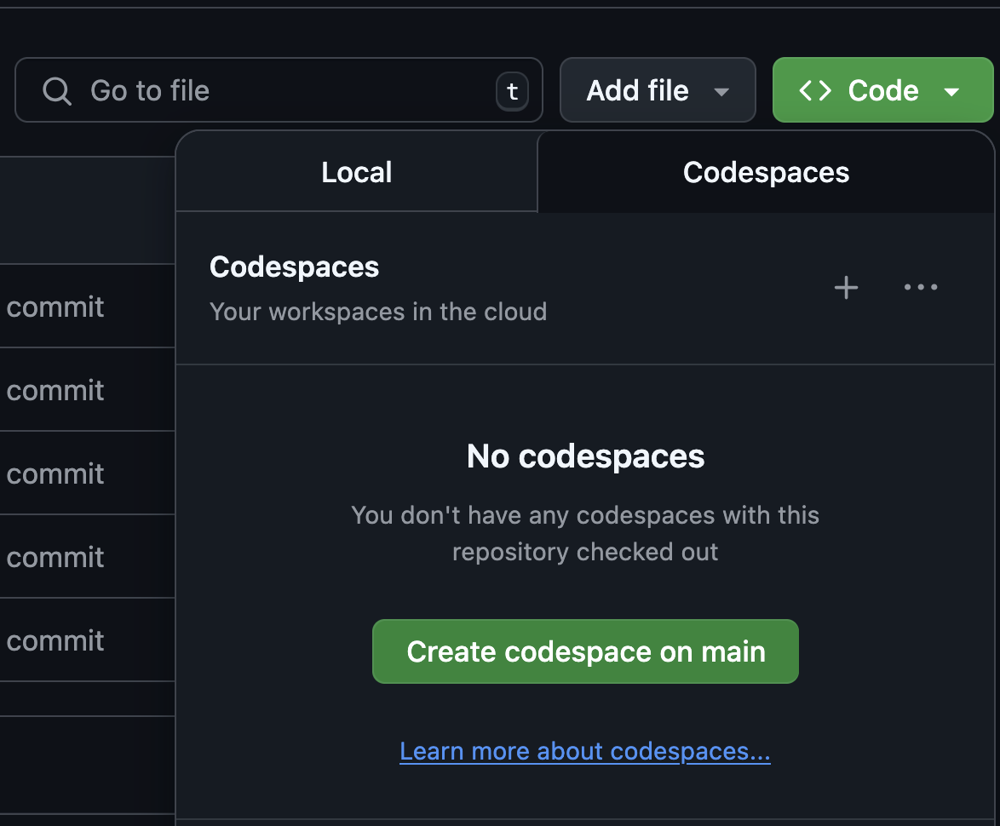

.. _chapelhome-quickstart:

Chapel Quickstart Instructions
==============================

These instructions are designed to help users get started with a single-locale
(shared-memory) implementation of Chapel as quickly as possible. If you want to
understand Chapel's configuration options, build process, and installation more
thoroughly, please refer to :ref:`readme-chplenv` and :ref:`readme-building`
instead.

The options for getting started, in order of preference, are:

1) `Binary Release via a Package Manager`_
2) `Containers (Docker)`_
3) `Building From Source via Spack`_
4) `Building From Source`_

Binary Release via a Package Manager
------------------------------------

Chapel provides binary releases for several platforms and operating systems. If
you are using a platform for which Chapel provides a binary release, we
recommend using it to get the easiest and fastest start with Chapel. To install
Chapel this way, download the appropriate package for your OS and platform and
install it using your system's package manager.

For example, on Ubuntu 24 with x86_64, you can use the following to install
Chapel 2.4:

.. code-block:: bash

   wget https://github.com/chapel-lang/chapel/releases/download/2.4.0/chapel-2.4.0-1.ubuntu24.amd64.deb
   sudo apt-get update
   sudo agt-get install ./chapel-2.4.0-1.ubuntu24.amd64.deb

For example, on Fedora 41 with aarch64, you can use the following to install
Chapel 2.4:

.. code-block:: bash

   wget https://github.com/chapel-lang/chapel/releases/download/2.4.0/chapel-2.4.0-1.fc41.aarch64.rpm
   sudo dnf update
   sudo dnf install ./chapel-2.4.0-1.fc41.aarch64.rpm

See `this page <https://chapel-lang.org/download/#linux>`__ for the most
up-to-date list of supported OSes and platforms.

brew
~~~~

If you are using `brew <https://brew.sh/>`__, you can also install Chapel
directly with ``brew install chapel``. This will install the latest Chapel
release available in the brew repository.

Containers (Docker)
-------------------

Chapel provides a number of Docker images that can be used to run Chapel in a
containerized environment. This is a good option if you want to try Chapel
without installing it on your host system or if you want to ensure that you
have a consistent environment across different machines.

We currently provide three different Docker images:

* chapel - basic Chapel compiler and standard library
* chapel-gasnet - Chapel with support for multi-locale (distributed memory) programming using GASNet over ethernet
* chapel-gasnet-smp - Chapel with support for multi-locale programming using shared memory

For example, the following is a minimal Dockerfile that uses the `chapel` image
to run a simple Chapel program:

.. code-block:: dockerfile

   FROM chapel/chapel:latest
   COPY hello.chpl /app/hello.chpl
   WORKDIR /app
   RUN chpl hello.chpl
   CMD ["./hello"]

Github Codespaces
~~~~~~~~~~~~~~~~~

Github Codespaces are a great way to quickly setup a developer environment for
Chapel without needing to install anything on your local machine. The
`chapel-hello-world <https://github.com/chapel-lang/chapel-hello-world>`__
repository provides a simple example of how to set up a Codespace for Chapel
development. This repository also provides a template that you can use to
create your own Codespace for Chapel development.

To start using Chapel with a Codespace, use the following steps:

1. Go to the `chapel-hello-world <https://github.com/chapel-lang/chapel-hello-world>`__ repository.
2. Click on "Use this template" to create a new repository based on the template.
3. In the new repository, click on the "Code" button, select "Codespaces", and then click on "Create codespace on main".

Building From Source via Spack
------------------------------

Chapel provides a `Spack <https://spack.io/>`__ package that can be used to
build Chapel from source. This is a good option if you want to use Chapel on a
system where a binary release is not available or if you want to customize the
build options. See `this page <https://chapel-lang.org/download/#spack>`__ for
more information on how to use Spack to install Chapel.

Building From Source
--------------------

These instructions are only intended to get a minimal, low-performance
configuration of Chapel up and running quickly to reduce build times and the
potential for third-party portability issues. For a more performant and fully
featured version of Chapel from source, refer to
:ref:`using-a-more-full-featured-chapel` below.

0) See :ref:`readme-prereqs` for information about system tools and
   packages you should have available to build and run Chapel.

1) If you don't already have the Chapel 2.6 source release, see
   https://chapel-lang.org/download/

2) Build Chapel in its 'Quickstart' configuration:

   a. Unpack the source release if you haven't already:

      .. code-block:: bash

         tar xzf chapel-2.6.0.tar.gz

   b. Make sure that you are in the directory that was created when
      unpacking the source release, for example:

      .. code-block:: bash

         cd chapel-2.6.0

   c. Set up your environment for Chapel's Quickstart mode.
      If you are using a shell other than ``bash`` or ``zsh``,
      see :ref:`quickstart-with-other-shells` below.

      .. code-block:: bash

         source util/quickstart/setchplenv.bash

   d. Use GNU make to build Chapel.  On some systems, you may have to
      use ``gmake`` if ``make`` is not a GNU version.

      .. code-block:: bash

         make

3) Compile an example program, which uses a ``forall`` loop to print messages:

   .. code-block:: bash

      chpl examples/hello3-datapar.chpl

4) Run the resulting executable, which will print 100 messages in parallel:

   .. code-block:: bash

      ./hello3-datapar

5) Experiment with Chapel in this Quickstart mode to your heart's
   content.  If you'd like to use this build of Chapel in a different
   shell / terminal session, see :ref:`using-chapel-in-another-shell`
   below.  Once you are comfortable with Chapel and interested in
   using a full-featured version in the preferred configuration, see
   the next section.

.. _using-a-more-full-featured-chapel:

Using Chapel in its Preferred Configuration
~~~~~~~~~~~~~~~~~~~~~~~~~~~~~~~~~~~~~~~~~~~

To use Chapel in its preferred, full-featured mode, you will need to
rebuild Chapel from source in a different configuration:

* Open up a new shell to avoid inheriting the previous environment
  settings.

* The Quickstart configuration attempts to detect if you have a compatible
  system installation of LLVM and clang. If you do not, it will set
  ``CHPL_LLVM=none`` for simplicity and to save time.  This causes
  the Chapel compiler to use its C back-end, which is not the preferred
  option; LLVM is the default back-end, which needs to be available for
  full functionality.  There are a few options for using LLVM:

  - Ensure that you have a compatible version of LLVM installed on your
    system and enable it with ``export CHPL_LLVM=system``.  Once you have
    it working, you can leave ``CHPL_LLVM`` unset and Chapel should
    detect it if it is in your path. See :ref:`readme-prereqs` for
    details on the currently supported LLVM versions.

  - Or, use ``export CHPL_LLVM=bundled`` to have Chapel build and use the
    bundled version of LLVM. Note that building the bundled version of
    LLVM can take a long time.

  - Use ``export CHPL_LLVM=none`` to continue using the C back-end rather
    than LLVM

  Please see :ref:`readme-chplenv.CHPL_LLVM` for more information about
  ``CHPL_LLVM`` and related configuration.

* If you are interested in building Chapel to support multiple compute
  nodes (locales), refer to :ref:`readme-multilocale` for other
  settings to enable that.

* Repeat steps 2-5 above, but in step 2, source
  ``util/setchplenv.bash`` instead of
  ``util/quickstart/setchplenv.bash``.  This will set up your
  environment to use Chapel in the preferred configuration.  Note that
  building this configuration involves compiling third-party packages,
  which will increase the overall build time.

  .. code-block:: bash

     # Set environment variables to preferred configuration
     source util/setchplenv.bash

     # re-build Chapel
     make

     # compile a sample program
     chpl examples/hello3-datapar.chpl

     # run the sample program
     ./hello3-datapar

  If you run into any portability issues, please see
  :ref:`readme-bugs`.

.. _using-chapel-in-another-shell:

Using Chapel in a Different Shell or Terminal
~~~~~~~~~~~~~~~~~~~~~~~~~~~~~~~~~~~~~~~~~~~~~

Note that in both the Quickstart and preferred modes above, any
environment settings made by ``setchplenv.bash`` will not persist
beyond your current shell/terminal session.  One easy way to use
Chapel from a different shell or terminal is to re-``source`` the
``setchplenv.bash`` script that you used when building Chapel.
However since this can quickly become annoying, other strategies are
available including a ``./configure`` + ``make install`` option.  See
:ref:`using-chapel-in-other-sessions` for details.

Using Chapel in Multi-Locale Mode
~~~~~~~~~~~~~~~~~~~~~~~~~~~~~~~~~

All of the "from source" instructions above describe how to run Chapel programs in
a single-locale (shared-memory) mode. To run using multiple locales
(multiple compute nodes with distributed memory), please refer to
:ref:`readme-multilocale`.

Notes on Performance
~~~~~~~~~~~~~~~~~~~~

If you plan to do performance studies of Chapel programs, be sure to
use the full-featured version above, to compile with ``--fast`` once
your program is correct, and to refer to
https://chapel-lang.org/perf-tips.html for other tips.

.. _quickstart-with-other-shells:

Quickstart with Other Shells
~~~~~~~~~~~~~~~~~~~~~~~~~~~~

Use the table below to identify the location of an appropriate
Quickstart ``setchplenv`` script, based on the shell you use.

==================================== ==========================================
**If you use:**                       **then type:**
------------------------------------ ------------------------------------------
a bash-compatible shell (bash/zsh)   ``source util/quickstart/setchplenv.bash``
a csh-compatible shell (csh/tcsh)    ``source util/quickstart/setchplenv.csh``
the fish shell (fish)                ``. util/quickstart/setchplenv.fish``
the Bourne shell (sh)                ``. util/quickstart/setchplenv.sh``
==================================== ==========================================

Scripts that set the preferred environment for each shell can be
located by removing ``quickstart/`` from the paths above.

What's next?
------------

For further information about Chapel, refer to the following resources:

============================ ==================================================
Online documentation:        :ref:`chapel-lang.org/docs <chapel-documentation>`
Platform-specific notes:     :ref:`../platforms <platforms-index>`
Example Chapel programs:     ``$CHPL_HOME/examples/README``
Setting Chapel env vars:     :ref:`chplenv.rst <readme-chplenv>`
Building the compiler:       :ref:`building.rst <readme-building>`
Compiling Chapel programs:   :ref:`compiling.rst <readme-compiling>`
Executing Chapel programs:   :ref:`executing.rst <readme-executing>`
Debugging Chapel programs:   :ref:`debugging.rst <readme-debugging>`
Reporting bugs:              :ref:`bugs.rst <readme-bugs>`
Performance:                 https://chapel-lang.org/performance.html
Chapel Editor Support:       :ref:`editor-support.rst <readme-editor-support>`
Chapel's file/dir structure: ``$CHPL_HOME/README.files``
Changes since last release:  ``$CHPL_HOME/CHANGES.md``
============================ ==================================================
