.. _chplvis:

.. default-domain:: chpl

-------
chplvis
-------
A Task and Communication Debug Tool for Chapel
----------------------------------------------

``chplvis`` is a tool to help the Chapel programmer visualize their
Chapel program's tasks and communication between locales.  Using the
standard module :mod:`VisualDebug`, the programmer controls what part
of their program generates information for chplvis.  During the run of
a program using the :mod:`VisualDebug` module, data files are
created that are used as input for ``chplvis``.  This document
will help you understand the :mod:`VisualDebug` module and the
``chplvis`` tool.

Setup
-----

``chplvis`` is built by giving the command ``make chplvis`` at the top level of
the chapel tree.  This also builds the GUI tool, *FLTK*, required to build and
run ``chplvis``.  (Note: Some versions of Linux may require the standard
package ``libx11-dev`` to be installed before *FLTK* will compile properly.)
To get the most out of this primer, you should compile and run the example
programs and examine the :mod:`VisualDebug` results with ``chplvis``.  The
example programs are found on the path ``examples/primers/chplvis``.  The
graphics in this primer were produced on a system using the ``fifo`` threads
instead of the default, ``qthreads``, for the tasking layer.   If you use
``qthreads``, your task count may differ from the examples.

Chapel Source Code
------------------

To use ``chplvis``, the programmer adds code to their program.  In many
cases, the programmer may want to investigate only part of the program.  This
is accomplished by having functions :proc:`~VisualDebug.startVdebug` and
:proc:`~VisualDebug.stopVdebug` to control where to start and stop the
instrumentation of their program.  Compilation and execution of these programs
remain the same.  When the :proc:`~VisualDebug.startVdebug` is executed, a
collection of files, one per locale, are created in a directory with the
``name`` given in :proc:`~VisualDebug.startVdebug`.

Example 1
---------

Consider the chapel program ``prog1.chpl``: (The example programs in this
primer are found in the directory ``examples/primers/chplvis`` in your
distribution tree.  The files have more comments than are shown here.)

.. code-block:: chapel

     //  Example 1 using visual debug

     use VisualDebug;

     startVdebug("E1");

     coforall loc in Locales do
       on loc do writeln("Hello from locale " + here.id + ".");

     stopVdebug();

Compiling the program and running it with the options ``-nl 6`` will then
produce a directory called ``E1`` containing 6 data files, one
for each of the locales and named ``E1-n`` where ``n`` is
replaced with the locale number, a number from 0 to 5.  Once this
directory is created, one can run chplvis as ``chplvis E1`` or
simply ``chplvis`` and then opening the file ``E1/E1-0``
from the ``file/open`` menu.  The resulting display is:

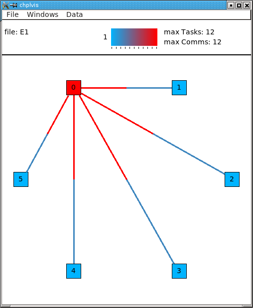

(Note: This image is from an X11 display.  On OS-X, the menu bar
will be on the normal menu bar at the top of the screen and will
not show in the main window.)

chplvis Elements
----------------

- The *information* box shows the file set opened, which tag (see
  `Example 2`_ ) is displayed, and provides a color bar to help visually
  see what values are displayed for locales and communication.

- A *Locale* is represented by a colored box in the main display.  The
  initial display draws the color of the locale to represent the
  number of tasks run at that locale.  For example 1, we can see that
  locale 0 has the most tasks and we expect that to be 12 since that
  is the maximum number of tasks as shown by the color reference in
  the information box at the top of the window.  Hover your mouse over
  a locale and it will display a "tooltip" that is the value for
  that locale.

- *Communication links* are shown by lines between two
  locale boxes.  The color of the line adjacent to a locale box 
  represents the data being sent to that locale from the locale on
  the other end.   For example 1, the line between locale 0 and
  locale 1 is colored red next to locale 0.  This means that there
  is a lot of communications *into locale 0* from locale 1.
  The blue line next to locale 1 means that there is little 
  communication *into locale 1* from locale 0.

  .. note::

    If two locales do not communicate, no line is drawn between them.  If
    communication is only one way, the communication color for *no
    communication* is gray.

- The *Data menu* controls what data is used for the display colors
  and available tooltip values.  This initial data is number of tasks
  for locales and number of communications calls for the communication
  links.  For locales, one can select number of tasks, CPU time, clock
  time or concurrency.  Clock time is normally very close to equal
  across all locales.  For the communication links, one can select
  number of communications or size of data sent.

Display Interaction
-------------------

Clicking on elements of the display will bring up more information.
Clicking on a locale will open a new window for that locale showing
information for that locale.  In example 1, clicking on locale 0 when
the locale data is 'number of tasks', 'CPU time' or 'clock time' will
produce a window that looks like:

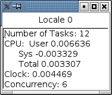

(Note: There is overhead generated in tasks, CPU time, clock time and
communication for the Visual Debug function calls.  ``chplvis`` removes
the overhead tasks and communication from displayed values, but it can
not remove the CPU and clock time overhead.)

.. _`Concurrency View`:

When the locale data selected is 'concurrency', clicking on a locale
will bring up a window that shows a task time line for the locale.
This display shows the order the tasks are executed and the color of
each task shows the clock time for that task.  The black vertical vertical
lines show the life time of the task.  There are two kinds of tasks
shown, taskes forked to this locale indicated by an *F* and tasks 
started locally indicated by an *L*.

.. note::

  The task order may change from run to run.  The following shows one possible
  execution order of the tasks:

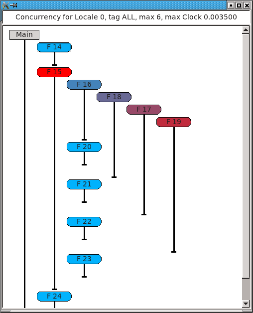

Note the special *Main* task.  It is shown as a square gray box because
it was already running at the start of the displayed data.

In this concurrency display, hovering the mouse over a task will bring
up a "tooltip" that shows the clock time taken by that task, the
number of *gets*, *puts* and *forks* performed by that task and if
available, the source file name and line number of the code that
started that task.  If the task has communication, clicking on the
task will cause the task's communications to be listed in the window
similar to the following:

.. image:: E1-L0-tc.png

The number in brackets is the clock time since the task started
execution.   This list gives details about the *gets*, *puts* and
*forks* initiated by this task.

In the main window, clicking on a communication line will create a
window with communication information for that link.  Clicking red
part of the line between locale 0 and locale 1 will produce a window
that looks like:

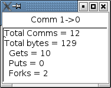

It is important to notice the direction of the *arrow* in the header
for the windows.  This is for communication from locale 1 to locale 0.
The total number of communication calls was 12.  It is further broken
out into three components:

  - *Gets:* This is a communication call initiated by locale 0 to
    get a data located on locale 1.

  - *Puts:* This is a communication call initiated by *locale 1*
    to put data from locale 1 onto locale 0.

  - *Forks:* This where *locale 1* starts a task running
    on locale 0.  As part of the task start, a block of data is sent to
    locale 0 as an argument to the task.  This data is considered a
    communication call  by *chplvis*.

.. _`Example 2`: 

Example 2
---------

In many programs, one will want to look at a number of small parts of
their program in addition to seeing the total statistics.  ``prog2.chpl``
gives an example of using the :mod:`VisualDebug` functions
:proc:`~VisualDebug.tagVdebug` and :proc:`~VisualDebug.pauseVdebug`.

.. code-block:: chapel

    // Example 2 of use of VisualDebug module and chplvis tool.

    use BlockDist;
    use VisualDebug;

    config var ncells = 10;

    proc main() {

       // Create a couple of domains and a block mapped data array.
       const Domain = { 1 .. ncells };
       const mapDomain = Domain dmapped Block(Domain);

       var  data : [mapDomain] int = 1;

       // Start VisualDebug here
       startVdebug ("E2");

       // First computation step ... a simple forall
       forall i in Domain do data[i] += here.id + 1;

       // Write the result, we want to see the results of the above
       // so we tag before we continue.
       tagVdebug("writeln 1");
       writeln("data= ", data);

       // Second computation step ... using the distributed domain
       tagVdebug("step 2");
       forall i in mapDomain do data[i] += here.id+1;

       // Don't capture the writeln
       pauseVdebug();
       writeln("data2= ", data);

       // Reduction step
       tagVdebug("reduce");
       var i = + reduce data;

       // done with visual debug
       stopVdebug();

       writeln ("sum is " + i + ".");
    }

Note that the ``startVdebug("E2")`` is placed after the declarations
so that tasks and communication for the declarations are not included.
The initial display of ``chplvis`` shows data for the entire run. (This
program was run on five locales.)

.. image:: E2-1.png

There is now a new menu called *Tags* that reflects the
:proc:`~VisualDebug.tagVdebug()` calls in the program.  Selecting the tags menu
gives the following display:

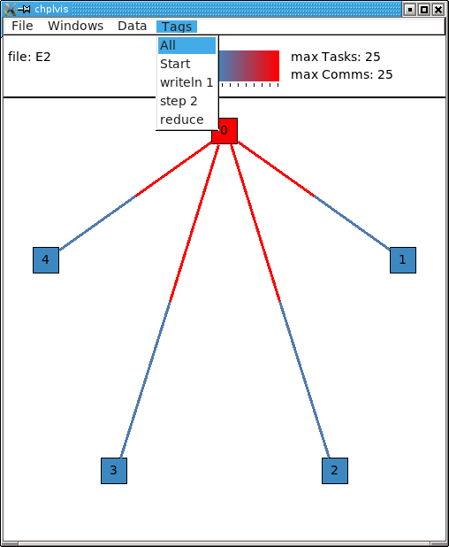

There are two special tags in this menu, *All* and *Start*.  *All*
shows the initial display for the entire run and *Start* shows the
tasks and communication only between the ``startVdebug("E2")`` call and
the first call to :proc:`~VisualDebug.tagVdebug()`, in this case, ``tagVdebug("writeln
1")``.  The display for the *Start* tag looks like:

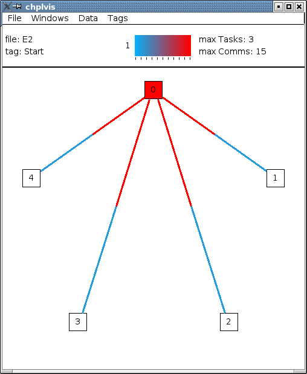

You should be able to immediately see that

  - Locale 0 has 3 tasks and all other locales do not have any tasks.
    (Task boxes colored white mean no tasks.)
    This means that locale 0 is doing all the computation.

  - The majority of communication is happening from other locales to
    locale 0.  By clicking on the communication links you should be
    to easily see that locale 0 is doing gets and puts for all the
    communication.

Compare the results of this first ``forall`` loop with the loop in the second
computation step, tagged *step 2*.  Notice, *step 2* does not include the
second ``writeln`` because of the call to :proc:`~VisualDebug.pauseVdebug()`.
That suspends collecting task and communication data until the next
:proc:`~VisualDebug.tagVdebug()` call.

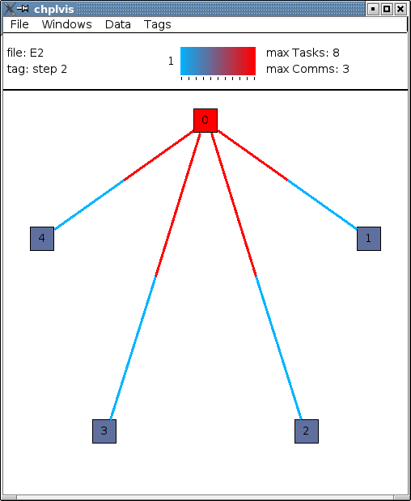

The difference between the two loops is the domain used.   *Domain*
is not a distributed domain, so the computation remains on locale 0. 
The ``mapDomain`` is a distributed domain, so the computation is 
distributed.  One needs to be careful in specifying these kind of loops
to make sure you use a distributed domain if you are operating on
distributed data and you want distributed computation.  This is 
where ``chplvis`` can quickly let you know if you used the wrong
domain in your ``forall`` loop.

Now, consider the *writeln 1* tag display.

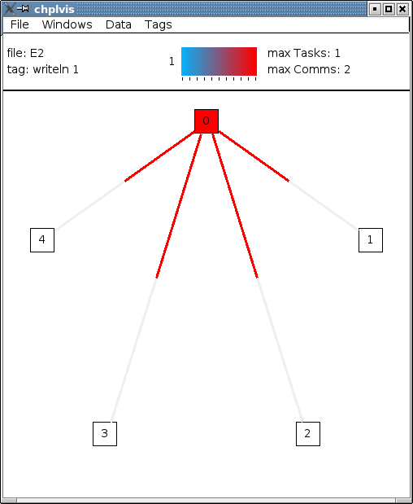

Notice the gray communication links.  This means there was no data
flow from locale 0 to the other locales.   The gray links are provided
to make it easy to visually see the corresponding locale.

Finally, for completeness, look at the display for the last tag
used, *reduce*.  It is very similar to the *step 2*
tag.

.. image:: E2-6.png

Example 3
---------

The program prog3.chpl is similar to the program
``examples/programs/jacobi.chpl``.  This version uses dmapped domains
and VisualDebug.  Only parts of the code are shown to illustrate
other ``chplvis`` features.  First, config variables are handy here so one
can create different directories of chplvis data on different runs.
Although not shown here, config params are useful to allow your
program to use VisualDebug and generate data only if you need it.

.. code-block:: chapel

    // Allow different runs to create different data directories so it is
    // easier to compare runs with chplvis.
    config var dirname = "E3";

    // Start VisualDebug here to see that distributed domain and variable
    // declarations generate tasks and communication.
    startVdebug(dirname);

Next, if :proc:`~VisualDebug.tagVdebug()` calls are made inside a loop, it
produces a unique tag for each call.

.. code-block:: chapel

   // Main computation loop -- we want to see the two parts of this
   // loop, the computation and the reduction part.

   while (delta > epsilon) {

     // Tag the computation part of this loop 
     tagVdebug("computation");

     for t in 1 .. compLoop do {
       forall (i,j) in R do
         A(i,j) = Temp(i,j);
       forall (i,j) in R do
         Temp(i,j) = (A(i-1,j) + A(i+1,j) + A(i,j-1) + A(i,j+1)) / 4.0;
     }

     // tag the reduction part of this loop.
     tagVdebug("max");
     forall (i,j) in R {
       Diff(i,j) = abs(Temp(i,j)-A(i,j));
     }
     delta = max reduce Diff;

     pauseVdebug();
     iteration += compLoop;
     if (verbose) {
       writeln("iteration: ", iteration);
       writeln("delta:     ", delta);
       writeln(Temp);
     }
   }

We use :proc:`~VisualDebug.pauseVdebug()` here to make sure chplvis data is generated for
the parts of the loop of interest.

This example was run with the command line arguments ``--n=8 -nl 8``.
The following shows the default *tags* menu for this run:

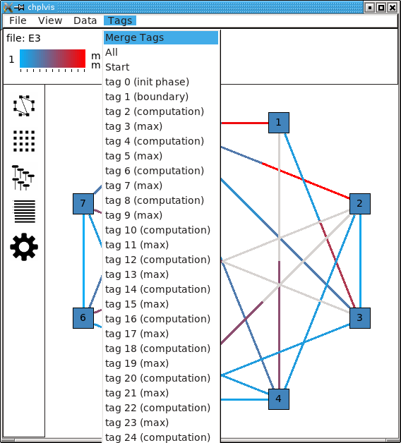

Notice that the tags are now numbered and the tags menu extends past
the end of the window. (This screenshot does not show the entire tags
menu that was displayed on the screen.)  *All* and *Start* remain the
same, but since two or more tags have the same name, ``chplvis`` shows a
unique tag for each :proc:`~VisualDebug.tagVdebug()` call.  Notice the new menu
item above *All* which is highlighted in this example.  *Merge Tags* allows you
to see data for tags with the same name to be merged together.  For this
example, with merged tags, the tags menu now looks like:

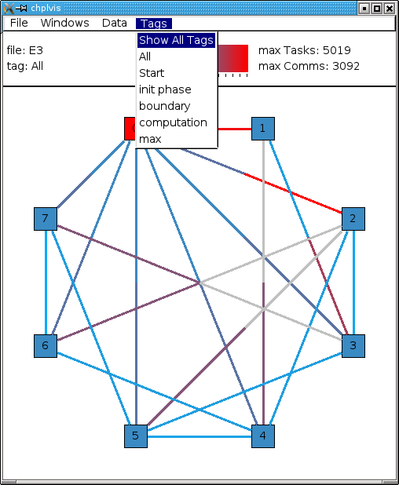

Now, selecting the tag *computation* will show the accumulated tasks and
communication for the entire *while* loop for just the computation
part of the loop.  This is all code between the ``tagVdebug("computation")``
call and the ``tagVdebug("max")`` call.   Selecting the tag *max* will
then show accumulated tasks and communication for the code between
the ``tagVdebug("max")`` call and the :proc:`~VisualDebug.pauseVdebug()` call.
The following shows the display for the *computation* tags and displaying *CPU*
data.

.. image:: E3-3.png

The concurrency display is not available for tags in the "merge tag mode"
except the *All* tag, which is the same for both tags mode.

This example has some extra config variables that can be used to help
understand the usefulness of ``chplvis``.  For example, one can compare
the CPU time used between the *computation* and *max* phases of this
Jacobi computation.  The config variable *compLoop* allows one to run
the computation loop more than once before then checking for convergence
in the *max* tagged code.  It is known that the Jacobi code will not
diverge and thus extra computation steps will not produce a "wrong"
answer.  By doing extra computation, the result will be a bit more
accurate.  The reader should use the *compLoop* and the *dirname*
config variables to run several versions of this program yielding
a ``chplvis`` directory for each run.  Then one can compare the different
results by running ``chplvis`` multiple times.  By a good choice of
the *compLoop* variable, one can dramatically reduce the CPU time for
computing the *max* while not increasing the *computation* time by much.

Example 4
_________

To help show another feature of the "`Concurrency View`_", prog4.chpl was
written to create a *begin* task on all locales and have those tasks
live across calls to the :mod:`VisualDebug` module.  The code is:

.. code-block:: chapel

   // Example 4, begin tasks as shown in chplvis
   // This is a contrived example to have tasks live
   // across a tagVdebug() call.

   use VisualDebug;
   use BlockDist;

   const space =  { 0 .. #numLocales };
   const Dspace = space dmapped Block (boundingBox=space);

   startVdebug("E4");

   var go$: [Dspace] single bool;
   var done$: [Dspace] single bool;

   // Start a begin task on all locales.  The task will start and then block.
   coforall loc in Locales do
     on loc do begin { // start a async task

              go$[here.id]; // Block until ready!
              writeln ("Finishing running the 'begin' statement on locale "
                        + here.id + ".");
              done$[here.id] = true;
           }

   tagVdebug("loc");

   coforall loc in Locales do
       on loc do writeln("Hello from " + here.id);

   tagVdebug("finish");

   // Let all tasks go
   go$ = true;

   // Wait until all tasks are finished
   done$;

   stopVdebug();

First we will look at the results of running this code on a single
locale.  Even though there is no communication, ``chplvis`` can help
you see how tasks are run, especially how much concurrency you have.

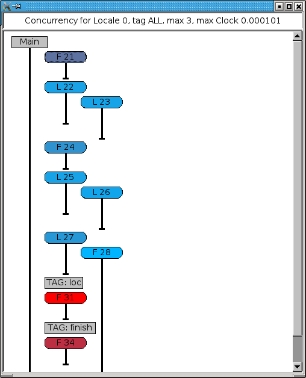

This view shows the tasks for locale 0, the only locale in this run.
Things to notice from this view are

  - Main represents the main program.  It is shown as a gray rectangular
    box to show that it was running at the time of
    :proc:`~VisualDebug.startVdebug()` was called.

  - In the *tag ALL* view, tags are shown in the sequence of tasks.

  - Task *F 28* is started before the *loc* tag, but it finishes
    in the *finish* tag.

.. image:: E4-2.png

This view shows the tasks for locale 1 on a 3 locale run for the tag
*loc*.  In this view, the task started before the *loc* tag appears
as a gray rectangular box at the top of the view.  This indicates
that is was running at the start of the tag.  The lack of a task
termination horizontal line on the task line indicates that the task
continued running past the end of the tag.  Tasks that are running
at the beginning of a tag and terminate during a tag can be seen
by the horizontal termination line, such as for task *C50*, a
*continued* task for locale 0 on the same 3 locale run as seen next.

.. image:: E4-3.png

*Main* will always show as a continued task with no termination.
*Main* is shown only for locale 0.  *Main* is included in the
calculation of concurrency as seen above.

..  Find more examples to show off more of chplvis 

..  Give examples of how to find problems. 

Final Comments
--------------

The following items are not covered above:

  - By clicking on the locale box or a communication link, a window
    with more detailed information is presented.  To make it easier
    to close those windows, a second click on the same location will
    close the window.   The *Windows* menu allows one to close
    or show all previously created locale and communication windows.

  - The command line for ``chplvis`` is::

      chplvis [name]

    where *name* may be the name of the directory or a file in the 
    directory generated by a run of a program using :mod:`VisualDebug`.
    If *name* is not given, it looks for the directory named
    ``.Vdebug`` which is generated if the :proc:`~VisualDebug.startVdebug`
    function is given a string of zero length.  ("")

  - In all the examples given, all calls to ``xVdebug()`` routines were
    essentially in the ``main`` program.   While this will not be the case
    in all programs, a couple of things should be noted.

    - All calls run code on all locales.

    - All calls should be made from locale 0.

    - Calls should not be made in ``on`` statements.  While such programs
      should run, the ``chplvis`` data will mostly likely not make much
      sense.

    - Calls should not be made in ``begin`` statements for similar reasons.

    - Calls should not be made in forall or coforall statements.

``chplvis`` was created in 2015 and first released with Chapel-1.12.0.
The Chapel team hopes this tool will be of use to Chapel programmers
and would like feedback on this tool.

:Author: Philip A. Nelson
